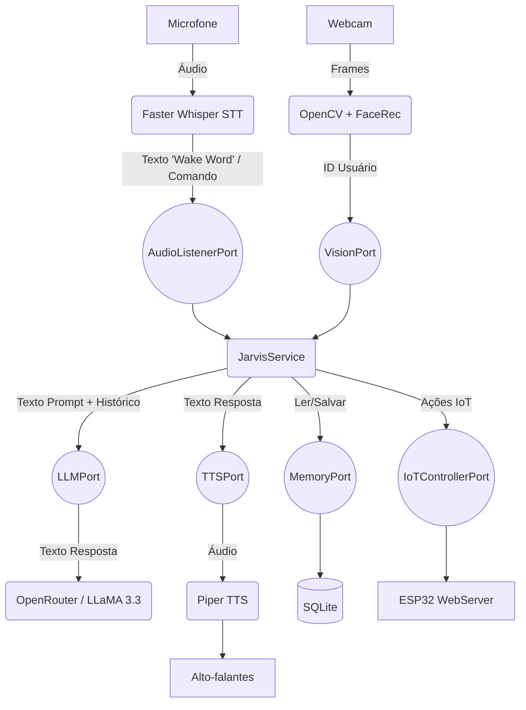

# J.A.R.V.I.S. Mini 🤖

Um assistente virtual inteligente, responsivo e projetado com foco em privacidade e processamento local (Offline-first), inspirado no assistente do Homem de Ferro.

O projeto utiliza uma **Arquitetura Hexagonal** (Ports & Adapters) para separar claramente o domínio da aplicação das integrações de hardware e APIs externas.

## 🌟 Arquitetura do Sistema



## 🛠️ Tecnologias Utilizadas

- **Core**: Python 3.12, FastAPI (Servidor Central), SQLAlchemy (SQLite)
- **STT (Ouvidos)**: `faster-whisper` (Offline, modelo `base` ou `tiny`)
- **TTS (Voz)**: `piper-tts` (Offline, voz `pt_BR-faber-medium`)
- **LLM (Cérebro)**: OpenRouter API (modelo LLaMA 3.3 70B gratuito)
- **Hardware (Futuro)**: Raspberry Pi 3/4, ESP32, Módulo Relé, LEDs RGB, Display OLED

## 🚀 Como Instalar e Rodar

1. **Clone o repositório e instale as dependências:**
   ```bash
   pip install -r requirements.txt
   ```

2. **Baixe o modelo de voz Piper (Faber):**
   Faça o download dos arquivos `pt_BR-faber-medium.onnx` e `pt_BR-faber-medium.onnx.json` e coloque-os na **pasta raiz** do projeto.

3. **Configure as Variáveis de Ambiente:**
   Copie o arquivo `.env.example` para `.env` e adicione sua chave de API do OpenRouter.

4. **Inicie o Servidor Central:**
   ```bash
   python -m src.main
   ```
   O Jarvis falará *"Sistemas online"*. Basta dizer **"Jarvis"** (ou "Davies", "Javis") para ativar, e depois diga seu comando.

---

## 🗺️ Roadmap e Próximos Passos (Fase 2)

O J.A.R.V.I.S. está em constante evolução. Os próximos passos (já desenhados no `implementation_plan.md`) são:

- [ ] **Módulo de Visão Computacional**: Integrar `OpenCV` e `face_recognition` em uma thread paralela. O Jarvis reconhecerá quem senta na frente do PC/Raspberry e fará saudações automáticas.
- [ ] **Integração IoT (ESP32)**: Desenvolver o firmware em C++ para um ESP32 que atuará como "Corpo" do Jarvis. Ele terá um servidor HTTP para receber comandos do Python e acionar luzes e relés pela casa.
- [ ] **Otimização Extrema**: Ajustar parâmetros para rodar com perfeição em ambientes de baixa RAM (como o Raspberry Pi 3 Model B - 1GB).

---
*Para instruções detalhadas de como montar o hardware físico (Raspberry + ESP32), consulte o arquivo `HARDWARE_SETUP.md`.*
# mini-jarvis
