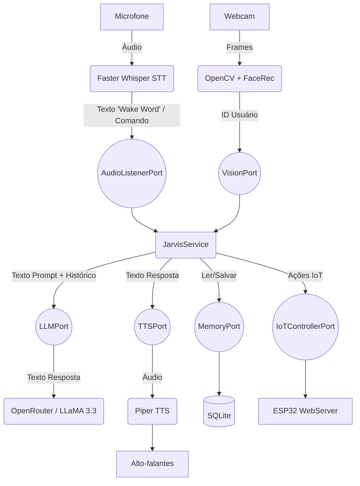

# J.A.R.V.I.S. Mini 🤖

Um assistente virtual inteligente, responsivo e projetado com foco em privacidade e processamento local (Offline-first), inspirado no assistente do Homem de Ferro.

O projeto utiliza uma **Arquitetura Hexagonal** (Ports & Adapters) para separar claramente o domínio da aplicação das integrações de hardware e APIs externas.

## 🌟 Arquitetura do Sistema



## 🛠️ Tecnologias Utilizadas

- **Core**: Python 3.12+, FastAPI (Servidor Central), SQLAlchemy (SQLite)
- **STT (Ouvidos)**: `faster-whisper` (Offline, modelo `base` ou `tiny`)
- **TTS (Voz)**: `piper-tts` (Offline, voz `pt_BR-faber-medium`)
- **LLM (Cérebro)**: OpenRouter API (modelo LLaMA 3.3 70B gratuito)
- **Visão**: OpenCV (Haar Cascades para detecção de presença)
- **Hardware**: Raspberry Pi 3/4, ESP32, Módulo Relé, LEDs RGB, Display OLED

## 🚀 Como Instalar e Rodar

### 1. Instale as dependências
```bash
pip install -r requirements.txt
```

### 2. Baixe o modelo de voz Piper (Faber)
Coloque os arquivos `pt_BR-faber-medium.onnx` e `pt_BR-faber-medium.onnx.json` na **pasta raiz**.

### 3. Configure o ambiente
Copie `.env.example` para `.env` e preencha sua chave do OpenRouter.

### 4. Inicie os 2 Processos (em terminais separados)

**Terminal 1 — API Server (Dashboard Web)**
```bash
python -m src.api_server
```

**Terminal 2 — Voice Worker (Mic + TTS + Visão + IoT)**
```bash
python -m src.voice_worker
```

> Os dois processos se comunicam via **SQLite** (tabela `task_queue`). Não precisa de Redis.

### 5. Acesse o Dashboard
Abra no navegador: **http://localhost:8000/dashboard**

---

## 📡 Firmware ESP32

O código do ESP32 está em `esp32_firmware/`. Para instalar:
1. Abra `main.ino` na Arduino IDE
2. Configure Wi-Fi em `config.h`
3. Instale as bibliotecas `Adafruit SSD1306` e `Adafruit GFX`
4. Faça o Upload para o ESP32

Consulte `esp32_firmware/README.md` e `HARDWARE_SETUP.md` para detalhes.

---

## ✅ Funcionalidades

- [x] **STT Offline** — Faster Whisper (modelo base)
- [x] **TTS Offline** — Piper (voz pt_BR-faber-medium)
- [x] **LLM Inteligente** — OpenRouter com personalidade J.A.R.V.I.S.
- [x] **Wake Word Híbrida** — Voz ("Jarvis") ou 2 palmas
- [x] **Visão Computacional** — Detecção de presença via OpenCV
- [x] **Dashboard Web Premium** — Interface HUD estilo Iron Man
- [x] **Integração IoT (ESP32)** — Relés + Display OLED
- [x] **Arquitetura Distribuída** — API Server + Voice Worker (sem Redis)
- [x] **Memória Persistente** — SQLite com histórico de conversas
- [x] **Intent Parser Local** — Classificação de comandos sem usar a API

---

*Para instruções de montagem do hardware (Raspberry Pi + ESP32), consulte `HARDWARE_SETUP.md`.*
